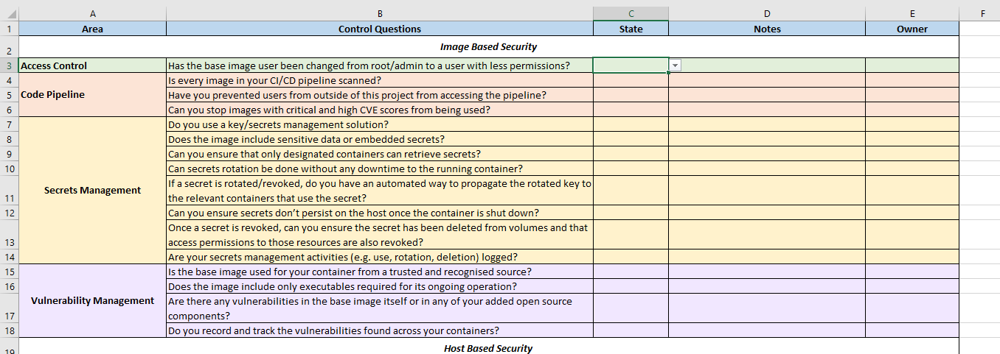

# container-security-checklist

This container security checklist has been created to help development teams implement security when deploying containerised applications.

The checklist is categorised into three sections, Image Based Security, Host based Security and Runtime Environment Security. It is split into: 

- Area - The controls are grouped into security areas, e.g. Access Control, Vulnerability Management etc.
- Control Questions - These are the security controls asked in a question format.
- State - There are four selections for each of the controls, Yes, No, In Progress & N/A. They are also colour coded for visualisation purposes.
- Notes - This section is for development teams to state their thoughts and how they have met/not met on the control.
- Owner - Who is responsible for the control.

